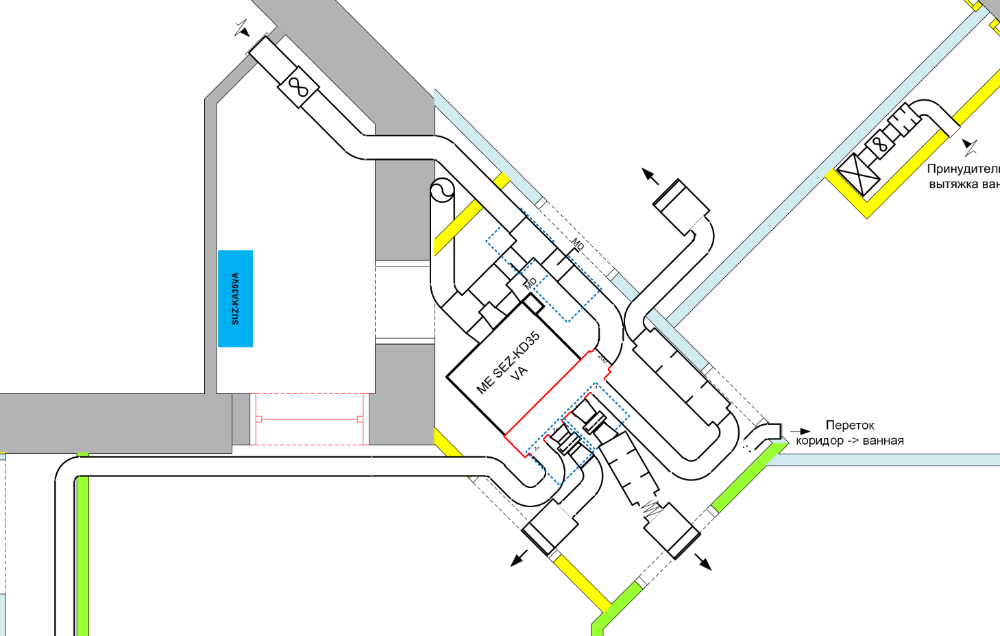
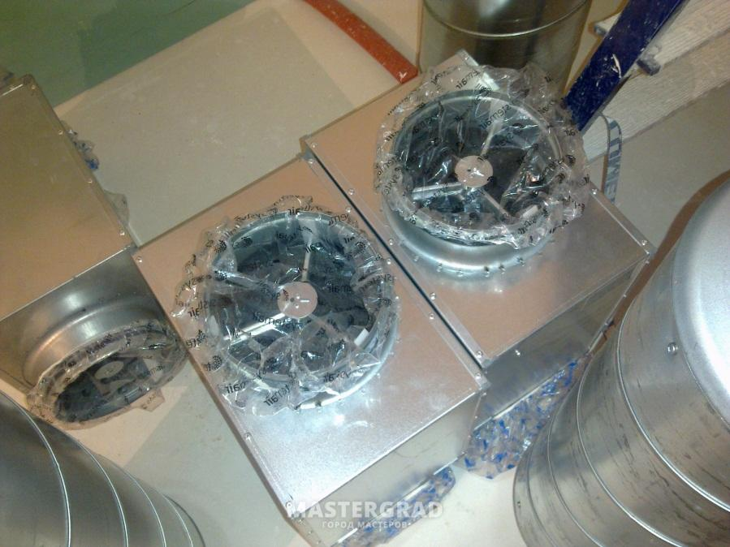
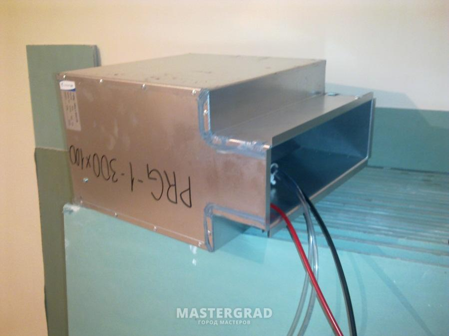
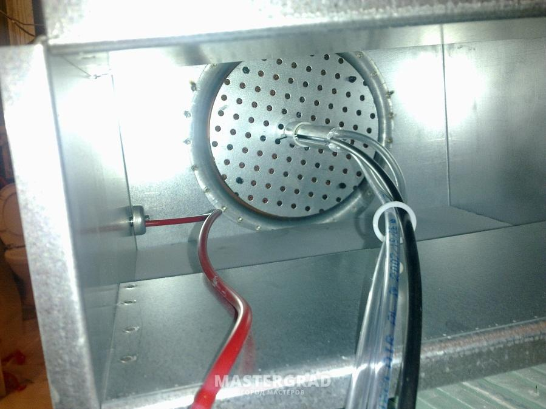
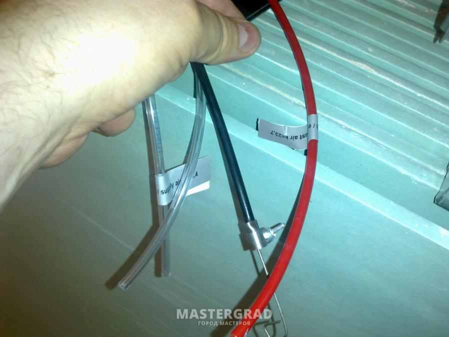

# Приточная вентиляция совмещенная с канальным кондиционером

[Схема вентиляции](./img/схема_полная_200.png)

Хочу поделиться опытом проектирования, монтажа и эксплуатации своей системы приточной вентиляции совмещенной с канальным кондиционером.

**Осторожно, под катом огромное количество фото !!**

## Благодарность мастерам

Будучи новичком в проектировании и монтаже систем вентиляции я прибегал к постоянной помоще и советам местеров с форум [my.mastergrad.com](https://my.mastergrad.com/).
Огромное спасибо за конструктивные и критические советы специалистов, без которых я не смог бы создать и настроить систему.

- пользователя **[Ким](https://my.mastergrad.com/users/36632/)** за крайне ценные советы и внимательно отношение к моим, зачастую глупым вопросам.
- пользователя **[Fresh](https://my.mastergrad.com/users/60668/)** за постоянную поддержку
- пользователя ****
- пользователя **[mr-h](https://my.mastergrad.com/users/125310/)** за ценные советы по настройке камер статического давления.

## Характеристики системы

Встречал разные [нормы воздухобмена для вентиляции квартир](https://www.airfresh.ru/normy-vozduhoobmena-dlya-zhilyh-zdaniy.htm).

Для себя принял, что минимум 80 м3 на комнату, с двумя человеками. Если хотите почустовать свежесть, то нужно около 120 м3.

Приточная вентиляция:

- четыре комнаты, от 80 м3 до 120 м3 на комнату. Итого от 320 м3 до 480 м3 на квартиру.
- вытяжка осуществляется в родные вытяжные каналы (3 канала: кухня, ванная, туалет).
- возможность балансировать воздушный поток между комнатами.
- требования к фильтрации EU5.

Требования к кондиционированию:

назначение - охлаждение поступающего воздуха (цели охлаждение в целом квартиры не ставлю)
подача воздуха в каждую комнату до 250 м3
желательно иметь один блок кондиционера, расположенный максимально далеко от жилых помещений.
желательно использовать те же воздуховоды, что и для приточки.

## Камеры статического давления

Для подачи воздуха в комнаты использовались камеры статического давления [Systemair ODEN-1-300x100](https://systemair-rus.ru/systemair-kamery). Характеристики в [Installation instructions](https://shop.systemair.com/upload/assets/PP-89_ODEN_EN_20190426_184315212.PDF).

Несколько фото:

что черная трубочка это оплетка тросика, которым передвигается круглый перфорированный рассеиватель (из фото непонятно надо тянуть или крутить тросик). Назначение рассеивателя - регулировать поток, увеличивая или уменьшая сопротивление потоку, ну и сам поток естественно рассеивать в камере, чтобы он не бил прямо на выход из камеры узкой струей, а распределился по всему сечению выхода. Остальные трубочки предназначены для подключения к дифференциальному манометру при проведении пусконаладки и датчикам давления, если они предусмотрены в вашем проекте. На ярлыках должны быть коэффициенты (K-фактор), по которым, используя формулу из инструкции, можно, измерив разницу давления дифференциальным манометром, получить расход воздуха через камеру. Разница давлений в прозрачной трубочке с ярлыком и прозрачной трубочке без ярлыка - для случая притока через камеру. Разница давлений в красной трубочке и прозрачной трубочке без ярлыка - для случая вытяжки через камеру. Если у Вас несколько комнат, куда раздается воздух, то балансировка между ними естественно нужна. Если регулировки камеры не хватит или шум большой будет получаться, тогда основную регулировку можно дроссель-клапаном делать, а камерой финишно доводить, не отходя от манометра.

## Разводка воздуховодов

## Подключение канального кондиционера

Зимой, это просто приточка с подогревом.
Принудительный приток, естественная вытяжка в родные вентиляционные каналы.
Расход воздуха принял 300-400 м3. Раздача в 4 комнаты, примерно по 80-100 м3.

Летом, канальное кондиционирование с подмесом воздуха.
Воздухообмен, планирую увеличить в два раза до 1000 м3 (из них 500 м3 забор из квартиры, 500 м3, с улицы).
Забор из квартиры будет в двух точках, в коридоре и из ванной.
Естественную вытяжку (чтобы выкинуть 500 м3), при необходимости дополню вентиляторами.
Мощность кондиционера около 4-5 Кват по холоду.

Система приточной вентиляции с электрическим калорифером

- Выбор системы
- Расчет сети воздуховодов
- Выбор производителя
- Система фильтрации
- Система распределения (камеры статического давления)
- Канальные глушители
- Монтаж системы
- Настройка воздушной системы
- Фильтры на заказ
- Опыт эксплуатации

Канальный кондиционер

- Выбор канального кондиционера
- Монтаж системы
- Опыт эксплуатации

Водяной калорифер в приточной вентиляции

- Расчет и выбор калорифера
- Смесительный узел
- Системы защиты водяного калорифера
- Электрическая система управления
- Монтаж системы
- Опыт эксплуатации
- Выводы

Расказ непрофисионала.

## Зачем нужна приточка

Первая квартира, которую купили в 2004 году была с пластиковыми окнами 

## Входные требования к системе

Требования к приточке:

- четыре комнаты, от 80 м3 до 120 м3 на комнату.
- подача воздуха, должна осуществляться в районе окна у батарей.
- вытяжка осуществляется в родные вытяжные каналы (3 канала: кухня, ванная, туалет).
- должна быть возможность балансировать воздушный поток между комнатами.
- приточный вентилятор должен быть расположен на балконе.
- требования к фильтрации EU5.
- высокие требования к шумоизоляции.

Требования к кондиционированию:

назначение - охлаждение поступающего воздуха (цели охлаждение в целом квартиры не ставлю)
подача воздуха в каждую комнату до 250 м3
желательно иметь один блок кондиционера, расположенный максимально далеко от жилых помещений.
желательно использовать те же воздуховоды, что и для приточки.

## Расчет сети воздуховодов

[Vent-Calc v2.0](http://www.sibclim.ru/2009/06/18/vent-calc-v2.0-programma-dlja-rascheta.html) 
