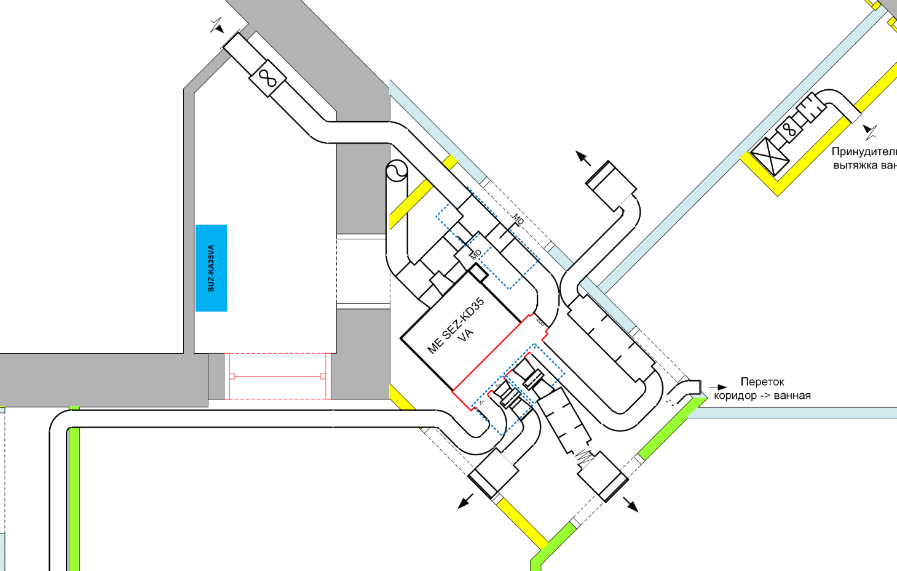

# Приточная вентиляция совмещенная с канальным кондиционером (часть 1 - водяная)

Хочу поделиться опытом проектирования, монтажа и эксплуатации своей системы приточной вентиляции совмещенной с канальным кондиционером. [Система](./img/full_plan2.png)
 собиралась в 2012-2013 годах и с тех пор находится в постоянной эксплуатации.

Статью разделил на две части:

- в [первой части](https://habr.com/ru/post/501344/) была описана классическая схема приточная вентиляции с использованием электрического канального подогревателя  
- в этой части расскажу про неоднозначный опыт переработки системы под водяной калорифер с питанием от общедомовой системы отопления

<cut />

## Благодарность мастерам

Еще раз огромное спасибо за конструктивные и критические советы специалистов, без которых я не смог бы создать и настроить систему.

- пользователя **[Ким](https://my.mastergrad.com/users/36632/)** за крайне ценные советы и внимательно отношение к моим вопросам
- пользователя **[Fresh](https://my.mastergrad.com/users/60668/)** за постоянную поддержку
- пользователя **[mr-h](https://my.mastergrad.com/users/125310/)** за ценные советы и активное участие

## Характеристики системы

Приточная вентиляция:

- четыре комнаты, от 80 до 120 м3/час на комнату
- вытяжка осуществляется в родные вытяжные каналы (3 канала: кухня, ванная, туалет)

Кондиционирование:

- забор воздуха с улицы - до 300 м3/час
- рециркуляция в квартире - до 300 м3/час
- подача воздуха в каждую комнату (три комнаты) до 200 м3/час

## Почему задумался про перевод на воду

Причин было три:

- во первых водяной калорифер не "выжигает" кислород. Температура носителя от 45 °C (на улице 0 °C) до 70 °C (на улице -28 °C). Электрические калориферы в основном управляются по ШИМ с периодом около 1 минуты. Но так как площадь контакта с воздухом очень маленькая, то приходится держать высокую температуру.
- во вторых была идея сэкономить за счет более дешевых цен на теплоноситель.
- в третьих, наверное самое главное, мне было интересно. Интерес как раз и перевесил все предупреждения специалистов.

Оценка экономики перехода с электричества на воду:

- данные по среднесуточной температуре в регионе проживания брал с какого-то сайта
- температуре воздуха в канале взял в 15 °C, но по опыту лучше брать 19 °C
- по оптимистичным оценкам экономия от воды - 5 000 - 7 000 руб./год (цены 2012)
- стоимость оборудования и работ в районе 50 000 руб
- прогнозная окупаемость - 8-10 лет

Что хотел реализовать:

- летом работает просто приточка + кондиционер (при необходимости) в обход калорифера
- зимой днем работает нагрев вода + электричество (приоритет на воду)
- зимой ночью работает нагрев электричество + вода (приоритет на электричество - так дешевле)

Как говорится "Гладко было на бумаге, да забыли про овраги".

 

## Разводка теплоносителя

Как выглядит разводка теплоносителя для батарей в моей квартире:

- от общего стояка идет гребенка на 4 квартиры
- между подачей и обраткой стоит регулятор перепада давления. Он настроен примерно на 200-300 кПа
- ввод в квартиру выполнен металопластиком 20 мм
- внутри квартиры изначально была выполнена разводка последовательно от одной батареи до другой
- переделал последовательное подключение на гребенку с индивидуальной разводкой до каждой батареи

   

   

Первым делом решил сделать оценку, сколько я могу снять со своей трубы отопления:

- рабочее давление в системе - 8-9 Bar, опрессовочное около 12-16 Bar
- при уличной температуре 0 °C, входная вода - 40 °C, выходная - 25 °C
  - расход на отопление по счетчику примерно 20 кВт/час в сутки
  - на батареях стоят регуляторы - поэтому они еле теплые - этого хватает чтобы поддерживать комфортную температуру в квартире +23 °C
  - если полностью открыть все регуляторы, то расход будет порядка 50 кВт/час в стуки на квартиру
- при уличной температуре -25 °C, входная вода - 70 °C, выходная - 45 °C
- по моим оценкам у меня есть запас 2-4 кВт/час, которые я могу дополнительно снять не нарушая работу батарей

Мощность, которая доступна для водяного калорифера сильно зависит от домовой автоматики (а у нас она погодозависимая).
Поэтому я решил подстраховаться и поставить перед водяным дополнительно электрический калорифер, который уже эксплуатировался в приточке.

## Контролер

Я искал максимально готовый контролер, который мог бы управлять как электрическим, так и водяным + электрическим калориферами. Остановился на [Electrotest OPTIMUS 911](https://electrotest.ru/production/controllers/). Перечислю только минимум функций, что мне потребовались.

- датчики температуры:
  - температура воздуха в канале
  - температура обратной воды на выходе из калорифера
- управление EC вентилятором сигналом 1-10 В
- управление трехходовым краном смесительного узла сигналом 1-10 В
- управление приводом воздушной заслонки
- управление электрокалорифером плавно по сигналу ШИМ, через твердотельные реле
- задействовал программируемые входы аварий:
  - авария по внутреннему датчику перегрева в калорифере
  - авария по датчику пожарной сигнализации в калорифере
  - авария размораживания калорифера по капиллярному термостату
  - авария протечки воды
- управление комбинированным нагревом: вода + электричество с приоритетом на воду
- программируемый режим день / ночь

Типовые сценарии:

- В режиме работы "электрокалорифер":
  - плавное регулирование по сигналу ШИМ с периодом 4 сек.
  - плавный старт с прогревом
  - плавное выключение с продувкой электрокалорифера на низкой скорости вентилятора
- В режиме работы "вода":
  - настраиваются уставки для температуры обратной воды: "темп. рабочая" (+30 °С), "темп. дежурная" (+20 °С), "темп. угроза замораживания" (+10 °С), "темп. прогрева" (+45 °С)
  - если температура обратной воды падает ниже "темп. рабочая", то контролер переходит в режим работы по приоритету воды вместо температуры в канале
  - если температура обратной воды падает ниже "темп. угроза замораживания", то контролер переходит в режим аварии, выключает вентилятор, закрывает воздушную заслонку
  - при старте системы, сначала прогревается калорифер до "темп. прогрева", после этого открывается заслонка и включается вентилятор
  - при остановке, система переходит в дежурный режим, температура обратной воды поддерживается на уровне "темп. дежурная"
- В режиме работы "вода + электро" с приоритетом на воду:
  - при старте системы, если температура обратной воды не достигает "темп. прогрева", то подключается  электрокалорифер
  - в ходе работа, если теплопроизводительность водяного калорифера недостаточна, то включается в работу электрический калорифер
- Переключение режима день / ночь:
  - переключается сухим контактом (например, по сигналу внешнего таймера): замкнуто — Ночь, разомкнуто — День. Эту функцию можно использовать для управления уставками температуры и скорости вентилятора по датчику влажности, СО

Интересные возможности контролера, которые планировал использовать:

- возможность регулировки температуры по внешнему датчику температуры в помещении с каскадным коэффициентом, который показывает на сколько градусов надо изменить температуру воздуха в канале при изменении температуры в помещении на 1 °С
- для калориферов из нескольких секций (у меня три секции по 1 кВт) предусмотрена ступенчатая коммутация: одна ступень плавно плюс три ступени дискретно

## Электрический калорифер

Электрический калорифер был выбран [Systemair CB 200-3,0](https://shop.systemair.com/en/cb--200--30--230v1--duct--heater/p105175). Мощности этого калорифера достаточно, чтобы подогреть 200 м3/час от -20 °C до + 18 °C.

- минимальный воздушный поток - 170 м3/час
- три отдельных секции по 1 кВт
- калорифер укомплектован автоматической биметаллической защитой от перегрева (нормально замкнутый контакт) и дополнительной защитой от перегрева с ручным перезапуском.

  

Я разделил его на две секции 1 + 2 кВт:

- секция на 1 кВт будет работать в режиме вода + электричество (приоритет на воду), подключение электрического калорифера производится автоматически, если водяной не будет справляться. Управления этой секцией осуществляется через твердотельное реле.
- секция на 2 кВт управляется от контролера PULSER. Его датчик температуры установлен после электрического калорифера, но перед водяным. Этот режим включается ночью - электричество + вода (приоритет на электричество). Две секции 2 кВт нагреют воздух на сколько смогут, остальное нагреет водяной калорифер.

Были опасения, что твердотельное реле будет перегреваться в корпусе калорифера, но оказалось, что он практически холодный. На всякий случай дополнительно в корпус калорифера был смонтирован стандартный пожарный датчик (температура срабатывания 70 °C) с нормально замкнутыми контактами.

  

## Водяной калорифер

Водяной калорифер был выбран [Systemair VBC 200-2](https://shop.systemair.com/en/vbc--200--2--water--heating--batt/p115407).

- Max operating temperature 150 °C
- Max operating pressure 1,6 MPa (16 Bar)

Расчет предельных характеристик калорифера. Входные данные:

- воздушный поток - 300 м3/час
- влажность входящего воздуха - 90 % r.H
- температура воздуха на входе - -20 °C
- температура носителя на входе - +75 °C
- температура носителя на выходе - +40 °C

Результаты расчета:

- температура воздуха на выходе - +15 °C
- влажность выходящего воздуха - 5 % r.H
- мощность - 4.1 кВт
- необходимый поток теплоносителя - 0.1 м3/час

Как выглядит калорифер. Качество отличное, толстый метал, все швы промазаны герметиком.

   

## Аварийная защита водяного калорифера

Водяной калорифер замораживается за считанные секунды - образуется ледяная пробка, поток останавливает и все - разрыв трубопровода.  А давление в системе 8 Bar.

Для защиты водяного калорифера от замораживания нужно:

- обеспечить постоянный поток теплоносителя через калорифер с определенной скоростью и предусмотреть источник бесперебойного питания
- контролировать температуру воды на выходе из калорифера
- контролировать температуру воздуха после калорифера
- предусмотреть систему аварийного перекрытия воздушного потока через калорифер
- запуск калорифера возможен только на прогретой системе
- остановка калорифера возможна только после перекрытия воздушного потока

Все эти функции берет на себя контролер.

Дополнительно с контролером желательно реализовать полностью независимую систему аварийной защиты от замораживания, которая срабатывала бы за несколько секунд. Датчики температуры воды и воздуха для этого не годятся - у них задержка показаний достигает нескольких минут.

Единственный действенный способ - это контроль температуры воздуха после калорифера капиллярным термостатом. Трубка термостата укладывается так, чтобы перекрыть всю площадь калорифера. Поток через калорифер будет неоднородным. В одном углу +15 °C, а в другом +5 °C. Особенно внимание нужно уделить месту, где сделан выход воды из калорифера - там самая большая вероятность заморозить.  
Нормально замкнутый сухой контакт из термостата подключаются к аварийному выходу контролера и к дополнительному реле.  
Если срабатывает защита, то параллельно с передачей сигнала на контролер, независимо от последнего, выключается приточный вентилятор и закрывается воздушная заслонка. Одновременно с этим, контролер максимально открывает трехходовой водяной кран и увеличивает подачу теплоносителя через калорифер.  

Проблема в том, что если калорифер уже разморожен - то вода пошла из системы, а вас, например, нет дома.
Так что в дополнение еще нужно поставить систему защиты от протечек с датчиками в воздушном канале, которая перекроет всю систему подачи теплоносителя.

   

Для аварийного закрытия заслонки нужен энергонезависимый механизм. Либо с мощной возвратной пружиной либо с суперконденсатором. У меня стоит [Belimo TF](https://www.belimo.ru/upload/uf/9a0/tf_all_15.pdf), с весьма большим временем закрытия - 75 с. Это очень много, за это время калорифер уже успеет заморозиться.
Приходится это компенсировать высокой уставкой в капиллярном термостате, не ниже +15 °C.

   

Если есть возможность, то лучше купить такой [Belimo NKQ24A-SZ](https://www.av-avtomatika.ru/belimo_nkq24a_sz/), стоит он конечно в три раза дороже, но и время закрытия всего 4 с.

Еще одна проблема, это полная остановка системы с выключением потока теплоносителя. Одной заслонки, на которой стоит привод типа [Belimo TF](https://www.belimo.ru/upload/uf/9a0/tf_all_15.pdf) не достаточно. Со временем резинка изнашивается и ее начнет продувать. Рекомендуют иметь две заслонки, одну перед, а вторую после вентилятора.

## Монтаж системы

Со стороны балкона схема поменялась, удалил входной глушитель, вместо него перед вентилятором поставил еще один фильтр G5. На основном канале вентиляции, в обход калориферов стоит клапан, в зимнем режиме он закрыт - воздух пойдет через калориферы.  

   

С помощью дворника была проделана дыра в стене на балкон. Хорошо, что стены легко ломать легко. Изнутри пенобетон, потом 15 см пенопласта и облицовка в пол кирпича. Планировка квартиры позволила сделать в углу около балкона маленькую кладовку размером 50х50 см.

   

Задача усложнялась тем, что нужно было разместить глушитель (длина 110 см, диаметр 30 см) после калорифер. Из-за этого монтаж получился очень плотным.

С помощью сверла, какой-то матери и круглого отвода, врезался в основной канал вентиляции, который у меня проходит под потолком. Слева от новой врезки видно забор воздуха кондиционером для рециркуляции.  
Установил шумоглушитель. Весит о порядка 5 кг, поэтому опирается на подпорки.

   

Примерил калориферы. Встало все в притирку, запас всего пару сантиметров. Расстояние между электрическим и водяным получилось маловато - нужно не менее двух диаметров. Это была одна из моих серьезных ошибок.

Утеплил уголок и заслонку пенофолом 2 см и запенил дыру. Калориферы соединяются на быстросъемных хомутах [FK 200 Fast clamp](https://shop.systemair.com/en/fk--200--fast--clamp/p117095). Хомуты просто сказка, позволяют за несколько секунд снять любой узел, плюс к этому изолируют вибрационный шум от вентилятора.

   

## Смесительный узел

Контролировать работу калорифера можно двумя способами:

- количественным - регулируя объем теплоносителя при постоянной температуре
- качественным - регулируя температуру теплоносителя, но сохраняя постоянный поток

Качественные способ считается более безопасным с точки зрения риска замораживания калорифера. Готовые смесительные узлы стоят дорого и рассчитаны на большую подачу. Мне интересно было сделать смесительный узел самому. Основным источником информации являлись форумы [forum.abok.ru/](http://forum.abok.ru/). Мастера с [my.mastergrad.com](https://my.mastergrad.com/) выступили в качестве серьезных критиков.

Итоговая схема:

- [трехходовой клапан](https://electrotest.ru/production/accessories/drives/bv.html) __1__ подключен в качестве смесительного органа, он установлен так, что выход С (на котором всегда есть подача) обращен в сторону калорифера __3__. Остальные два входа подключены к внешнему контуру __9__ и внутреннему контуру __10__ через обратный клапан __11__. Вентиль __12__ позволяет эксплуатировать клапан в режиме двухходового.
- циркуляционный насос __2__ установлен в малом контуре на обратке. Чтобы минимально влиять на сеть отопления, был выбран самый слабый [Grundfos COMFORT 15-14](https://ru.grundfos.com/products/find-product/comfort.html). Были сомнения в производительности, но в итоге, он смог обеспечить необходимые калориферу 0,1 - 0,2 м3/час.
- для балансировки внутреннего контура добавил байпас __4__ с обратным клапаном __5__ и вентилем __6__
- чтобы не остановить внешний контур добавил байпас __7__ с вентилем __8__
- запорная арматура установлена с обоих концов __13__
- чтобы контролировать поток, через калорифер, поставил обычный водяной счетчик

На фото итоговый результат:

- на втором фото запечатлен момент работы при наружной температуре -25 °C. При этом этом трехходовой клапан открыт примерно на половину, температура воды на подаче +75 °C, температура обратной воды +50 °C.

   

## Автоматика управления

Электрическую схему проектировал с использованием [SPlan7.0](http://radiostorage.net/943-splan7-0-programma-dlya-risovaniya-ehlektronnyh-skhem.html). Схема в [большом разрешении](./img/automatic/automatic4_full.jpeg).  
 

Для защиты от протечек дополнительно поставил [NEPTUN BUGATTI BASE 1/2 ДЮЙМА](https://neptunsale.ru/products/neptun-bugatti-base-1-2). Контакты аварии вывел на контролер, дополнительно выключаю циркуляционный насос.

Монтаж щитка выполнил преимущественно на компонента ABB, единственно взял у Legrand силовые реле. Силовая часть собрана в нижней части щитка, низковольтная и сигнальная в верхней.

   

## Первое тестирование системы

Дали отопление - опробовал систему

- расход воздуха пока на минимуме - около 100-120 м3/час
- перепад давления в сети отопления на грани чувствительности манометра - 0,1-0,2 Bar.
- без насоса циркуляция через калорифер очень низкая - 90 л/час
- при включенном насосе циркуляция поднялась до - 180-200 л/час
- температура подающей воды - 35-37 °C
- температура обратной воды - 30-31 °C
- температура на улице - около 0 °C
- температура в канале - 23 °C

Тестирование в экстремальных режимах:

- старт системы с перекрытыми кранами, без подачи теплоносителя
  - циркуляции в калорифере нет, он наполнен горячей водой - температура обратки +35 °С
  - контролер открывает наружную заслонку и включает вентилятор (скорость - 30% - 100-120 м3/час)
  - температура обратки не меняется, так как нет потока, температура в канале начинает падать
  - через пару минут температура в канале упала до +15 °С (термостат защиты от замораживания настроен на +10)
  - включился электрический подогреватель и через несколько минут вытянул температуру до уставки
  - попробовал такой же эксперимент при высокой скорости вентилятора - 60%. Электрический подогреватель не успел включиться - сработал капиллярный термостат защиты - система обиделась и выключилась
- работа системы без циркуляционного насоса
  - температура обратки +35 °С, система нормально стартует
  - через пару минут температура обратки падает до +25 °С, температура в канале не поднимается выше +18 °С
  - включился электрический подогреватель и через несколько минут вытянул температуру до уставки
- нет электричества и рециркуляции, аварийная остановка системы
  - температура на улице -3 °С
  - температура обратки +37 °С
  - перекрыл краном подачу воды и выключил контроллер (перевел в дежурный режим)
  - заслонка закрывалась примерно 40 сек. Аварии по капиллярному термостату не было (он установлен на +15 °С).
  - включил контролер и включил подачу воды.
  - контроллер показал температура обратки +27 °С.

Впечатления после первой ночи эксплуатации:

- ночью система работала с включенным циркуляционным насос (расход воды около 200 л/час) и расходом воздуха около 120 м3/час.
- электрический калорифер не включался (проверяю расход по отдельному счетчику)
- трехходовой клапан открыт не полностью - есть небольшой запас по мощности
- в квартире установлено 5 батарей - на них термоголовки, выставленные в среднее положение. Все батареи были умеренно теплыми
- расход тепла по счетчику отопления за 10 часов - 12 кВт/час включая батареи

## Первый опыт эксплуатации

Эксплуатация и первые замеры:

- с 30 сентября температуру подающей воды подняли до 40 °С.
- при этой температуре система нормально работает при скорости 40 % (около 150-200 м3/час), максимальная температура в канале до 28 °С (на фото выше). И это при выключенном рециркуляционном насосе.
- если включить насос, то трехходовой кран находится в почти закрытом положении. Это обнадеживает, что есть запас по мощности.

Сделал замеры по счетчикам всех квартир на площадке за 2 суток при выключенном насосе

- 2-х комнатная 85 м2 - 78 кВт/час
- 1-х комнатная 50 м2 - 44 кВт/час
- 1-х комнатная 45 м2 - 43 кВт/час
- 3-х комнатная 110 м2 - 76 кВт/час

Следующие 2 суток при включенном рециркуляционном насосе

- 2-х комнатная 85 м2 - 77 кВт/час
- 1-х комнатная 50 м2 - 44 кВт/час
- 1-х комнатная 45 м2 - 41 кВт/час
- 3-х комнатная 110 м2 - 77 кВт/час

Можно сделать предварительные выводы, что:

- приточка не влияет на потребление соседей, как минимум при текущих параметрах.
- радует, что я не зря потратил много сил на утепление наружных стен - на отопление я трачу как двушка

Завершился первый месяц эксплуатации.

- был неприятный момент - выключали электричество во всем доме. При этом остановились и насосы отопления в подвале
- приточка пыталась несколько перезапуститься автоматически, но у меня был выключен рециркуляционный насос и она каждый раз падала по аварии замораживания калорифера.
- отключил автоматический рестарт и купил бесперебойник для питания насоса.

Первый месяц эксплуатации - октябрь 2013:

- Показания счетчиков
  - вода - 983 кВт/час, включая батареи
  - электричество на приточку - 42 кВт/час (два дня была низкая температура воды, включался электрический калорифер)
  - в прошлом году приточка грелась от электричества - потратил 340 кВт/час.
- Показания счетчиков отопления квартир на площадке (за месяц):
  - 2-х комнатная 85 м2 - 1102 кВт
  - 1-х комнатная 50 м2 - 561 кВт
  - 1-х комнатная 45 м2 - 608 кВт
  - 3-х комнатная 110 м2 - 983 кВт

Второй месяц эксплуатации - ноябрь 2013:

- Показания счетчиков
  - вода - 1170 кВт/час, включая батареи
  - электричество на приточку - 39 кВт/час
- Показания счетчиков отопления квартир на площадке (за месяц):
  - 2-х комнатная 85 м2 - 1132 кВт/час. Среднее - 13,3 кВт/час/м2
  - 1-х комнатная 50 м2 - 554 кВт/час. Среднее - 12,5 кВт/час/м2
  - 1-х комнатная 45 м2 - 627 кВт/час. Среднее - 12,3 кВт/час/м2
  - 3-х комнатная 110 м2 - 1170 кВт/час. Среднее - 10,6 кВт/час/м2

За первые три месяца эксплуатации на электричестве сэкономил 3000 кВт - около 10 000 руб.

## Экстремальная эксплуатации -25 °С

Закончился январь 2013, показания счетчиков за месяц:

- вода - 2215 кВт/час, включая батареи
- электричество на приточку - 48 кВт/час

В самый холодные дни (-25 °С) ежедневное потребление составляло 120 кВт (батареи + приточка).  
В январе сэкономил на электричестве 3500 руб (по сравнению с январем 2013 года).  
Так же порадовало, что даже на открытых частях воздуховодов нет конденсата, только изморозь.  

В самый холодный день января первый раз сработала защита.  
Вечером прихожу с работы, на улице -25 °С, приточка выключена. Начал разбираться.

- посмотрел в контроллере список аварий - сработал капиллярный термостат защиты калорифера.
- заслонка закрыта, вентилятор выключен
- давление воды в норме - 8 Атм, потеков воды нет
- водяной счетчик показывает, что циркуляция воды в норме - 200 л/час.
- а вот температуры воды на входе резко упала и стала +55 °С (а еще утром была +75 °С)

Решился на эксперимент:

- включаю контролер. Прогревается калорифер и открывается заслонка, включается вентилятор.
- температура воздуха в канале начинает медленно падать (видно не хватает температуры приточной воды в +55 °С).
- через 1 мин температура в канале по датчику воздуха достигает +20 °С, срабатывает капиллярный термостат и приточка выключается.

У меня были выставлены следующие параметры защиты:

- температура защиты от замораживания обратной воды +15 °С
- температура защиты от замораживания приточного воздуха +16 °С
- температура защиты от замораживания капиллярного термостата +15 °С

Капиллярный термостат наиболее быстро реагирует, поэтому он срабатывает первым. Калорифер обдувается не равномерно и на отдельных его частях температура упала ниже +15 °С.

Понизил температуру капиллярного термостата до +10 °С. Приточка нормально запустилась, температура воздуха в канале стабилизировалась на +18 °С. Через 3 мин. такой работы автоматически включился электрический нагреватель и поднял температуру в канале до заданных +25 °С. Через день, температуры воды на входе поднялась до +65 °С и электрический нагреватель автоматически выключился.

## Это фиаско ...

Дело было так:

- температура на улице достаточно быстро понижалась с -5 °С до -18 °С
- вода в системе отопления оставалась на температуре +45 °С градусов. Наша домовая автоматика не спешила поднимать температуру в системе отопления
- производительности калорифера не хватило для поддержания уставки +23 °С и температура упала ниже +15 °С. Электрический калорифер не спешил включаться.
- сработала защита калорифера от замораживания, которая была установлена на +15 и система выключилась
- я понизил защиту калорифера до +5 °С градусов и включил систему расчет был, что система запустится сначала на воде и нагреет воздух примерно до +5°С через 5 минут должен подключиться электрический калорифер, который установлен перед водяным и он поднимет температуру до нормальных +23 °С
- в целом все так и получилось, только через пару часов нашел большую лужу воды под калорифером
- вскрытие показало, что медленно подтекает вода где-то в дальнем конце калорифера.

Перешел опять на подогрев электричеством.

## Что дальше

Долгое время отапливался электричеством. Но нашу управляющая компания сделала всем неприятный сюрприз. Отопление стали считать не по индивидуальным счетчикам, а по общедомовому. И распределять пропорционально площади квартир.  

Я стал платить за отопление в 2 раза больше. Двушка на нашей площадке потребляет больше, чем моя квартира включая батареи и приточку. Наверно они стали платить меньше.

Так что буду восстанавливать систему.
